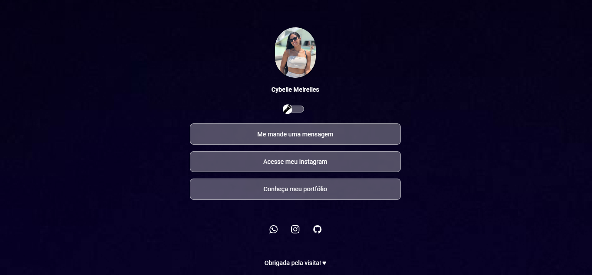
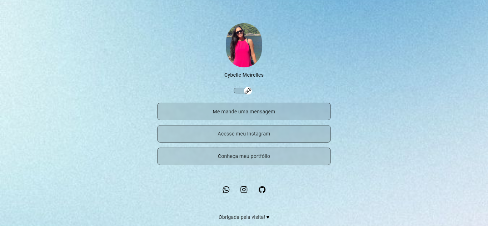

<h1 align="center"> Cybelle Meirelles </h1>

Programa desenvolvido para uso pessoal. 

  <a href="#-tecnologias">Tecnologias</a>&nbsp;&nbsp;&nbsp;|&nbsp;&nbsp;&nbsp;
  <a href="#-projeto">Projeto</a>&nbsp;&nbsp;&nbsp;|&nbsp;&nbsp;&nbsp;

 

  
  

## 🚀 Tecnologias

Esse projeto foi desenvolvido com as seguintes tecnologias:

- HTML e CSS
- JavaScript
- Git e Github

## 💻 Projeto

Este projeto é um agregador de links para usar como cartão de visitas online.

- [Acesse o projeto finalizado online](https://cybellemeirelles.github.io/cybellemeirelles/)

Obrigada pela visita ♥ :tada:
